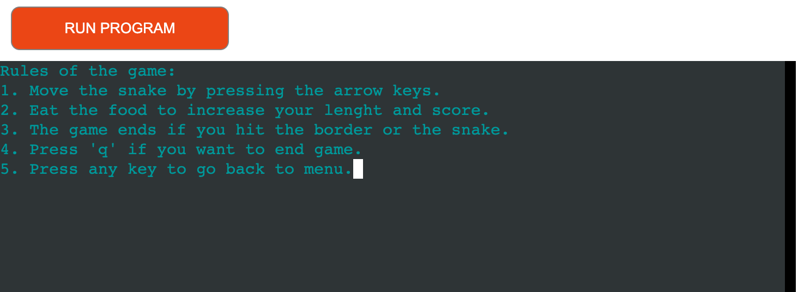
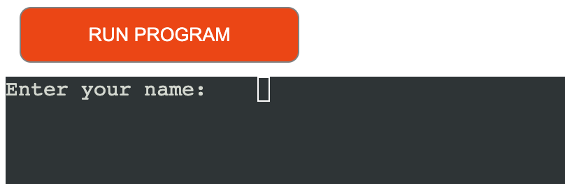
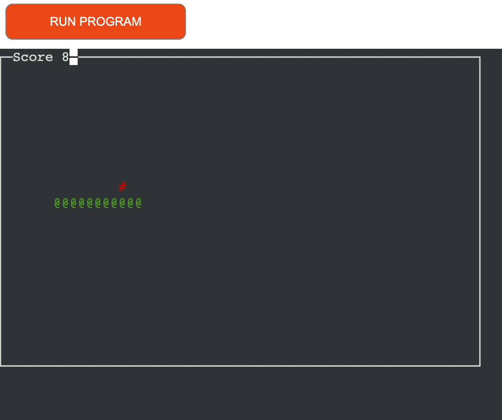
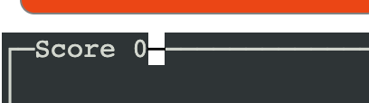
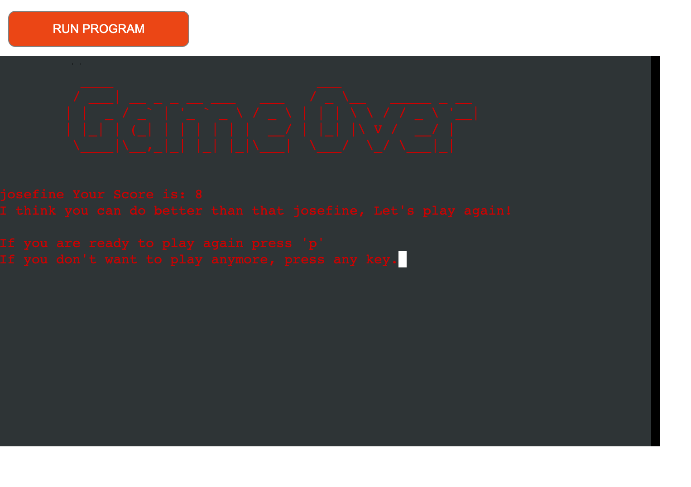

# Snake Game
Welcome to the Snake Game, a classic text-based game brought to life using Python. This project is a simple yet engaging implementation of the timeless Snake game.

## Contents
**Table of content:**
- [User Experience](#user-experience)
- [Features](#features)
- [Testing](#testing)
- [Deployment](#deployment)
- [Credit](#credit)

## User Experience

### First time user

### Design

## Fetures
### Welcome Screen

The welcome screen displays ASCII art snake and a welcome message and instructions on how to start the game.

### Rules Screen

The rules screen explains the game rules and waits for user input go go back to menu.

### User Name Input

The user name function prompts the user to enter their name before the game starts.

### Main Game 

When the game starts the user controls the snakes direction with the arrowkeys. Every time the snake eats the food new food shows up in a random place. If the user hits the game borders or itself the game ends.

### Live Score

For a better user experience the player can see the live score at the top left corner of the screen.

### Game Over Screen

The game over screen displays ASCII art, the user's name and score. Asks if they want to play again and waits for user input.

## Testing

## Deployment

### HEROKU

To the deploy this project i followed the deployment guide from love sandwiches.

Before i deployd i to Heroku i used "pip3 freeze > requirements.txt" to add dependencies that's requierd for the game to work in Heroku.
<ol>
<li> Set up a Heroku account. </li>
<li> On the Heroku dashboard, select create new app.</li>
<li> Choose a name for your app.</li>
<li> Select a region.</li>
<li> Click on "Create app"</li>
<li> Go to settings and go to Config Vars.</li>
<li> Enter CREDS in the key box and in value add the content from the creds.json file, then click the Add button.</li>
<li> Enter PORT in the next key box and 8000 in the value box, then click Add.</li>
<li> Scroll down to the Buildpack, select the python pack and click on save.</li>
<li> select node.js and save. </li>
<li> Make sure the Bulidpack is in the correct order, python first and node.js second. </li>
<li> Scroll up to the top of the page and click on the Deploy tab. </li>
<li> select GitHub as deployment method. </li>
<li> Enter the name of your repository and connect to it. </li>
<li> Scroll down and choose Enable automatic deployments or deploy manually. </li>
<li> When the deployment is done click on view to see your application. </li>
</ol>

## Credit

| Knowledge about | Source |
| -------------------------- | --------------- | 
| How to make a snake game using curses: Mision     Codigo youtube tutorial | https://www.youtube.com/watch?v=_IKIkRMfZJA |
| how to make a snake game using curses: Partick Loeber youtube tutorial| https://www.youtube.com/watch?v=M_npdRYD4K0 |
| how to use colors: | https://www.youtube.com/watch?v=JBE4OwdqzQ8 |
| ASCII art | https://www.asciiart.eu/text-to-ascii-art |
| Curses functions | https://docs.python.org/3/library/curses.html |
