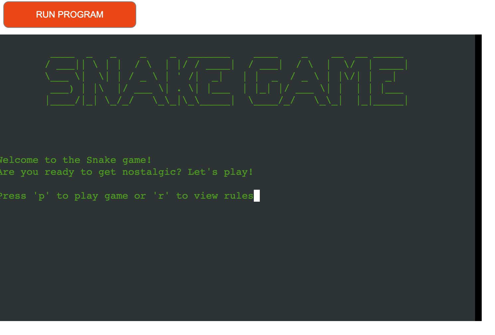

Welcome to the Snake Game, a classic text-based game brought to life using Python. This project is a simple yet engaging implementation of the timeless Snake game.

# Snake Game
A simple Snake Game for everyone feeling nostalgic and wants to have some fun.
## Contents
**Table of content:**
- [User Experience](#user-experience)
- [Features](#features)
- [Testing](#testing)
- [Deployment](#deployment)
- [Credit](#credit)

## User Experience

### First time user

### Design

## UX

## Fetures
### Welcome Screen

The welcome screen displays ASCII art snake and a welcome message and instructions on how to start the game.

### Rules Screen
The display_rules function shows the rules of the game. It uses panel.new_panel to create a panel for the rules, which is then displayed on the screen. The rules are displayed using stdscr.addstr, and the function waits for user input with stdscr.getch() before hiding the panel and returning to the main menu.
### User Name Input
The user_name function prompts the user to enter their name. It uses curses.echo() to enable echoing of characters and stdscr.getstr to get the user's input.
### Main Game Loop
The main_game function is where the main game logic resides. It initializes the game area, sets up color pairs for the snake and food, and handles the game loop. The game loop includes:
Handling user input to move the snake.
Updating the snake's position based on the direction.
Checking for collisions with the game area borders or the snake itself.
Handling the snake eating food, increasing the score, and generating new food.
Updating the game area to reflect the new positions of the snake and food.
### Game Over Screen
The game_over_screen function displays the game over screen, showing the user's score and asking if they want to play again. It uses curses.init_pair to define a color pair for the game over text and stdscr.addstr to display the text.

## Testing

## Deployment

### HEROKU

To the deploy this project i followed the deployment guide from love sandwiches.

Before i deployd i to Heroku i used "pip3 freeze > requirements.txt" to add dependencies that's requierd for the game to work in Heroku.
<ol>
<li> Set up a Heroku account. </li>
<li> On the Heroku dashboard, select create new app.</li>
<li> Choose a name for your app.</li>
<li> Select a region.</li>
<li> Click on "Create app"</li>
<li> Go to settings and go to Config Vars.</li>
<li> Enter CREDS in the key box and in value add the content from the creds.json file, then click the Add button.</li>
<li> Enter PORT in the next key box and 8000 in the value box, then click Add.</li>
<li> Scroll down to the Buildpack, select the python pack and click on save.</li>
<li> select node.js and save. </li>
<li> Make sure the Bulidpack is in the correct order, python first and node.js second. </li>
<li> Scroll up to the top of the page and click on the Deploy tab. </li>
<li> select GitHub as deployment method. </li>
<li> Enter the name of your repository and connect to it. </li>
<li> Scroll down and choose Enable automatic deployments or deploy manually. </li>
<li> When the deployment is done click on view to see your application. </li>
</ol>

## Credit

| Knowledge about | Source |
| -------------------------- | --------------- | 
| How to set up the google sheet: | Love sandwiches |
| How to make a snake game using curses: Mision     Codigo youtube tutorial | https://www.youtube.com/watch?v=_IKIkRMfZJA |
| how to make a snake game using curses: Partick Loeber youtube tutorial| https://www.youtube.com/watch?v=M_npdRYD4K0 |
| how to use colors: | https://www.youtube.com/watch?v=JBE4OwdqzQ8 |
| ASCII art | https://www.asciiart.eu/text-to-ascii-art |
| Curses functions | https://docs.python.org/3/library/curses.html |
