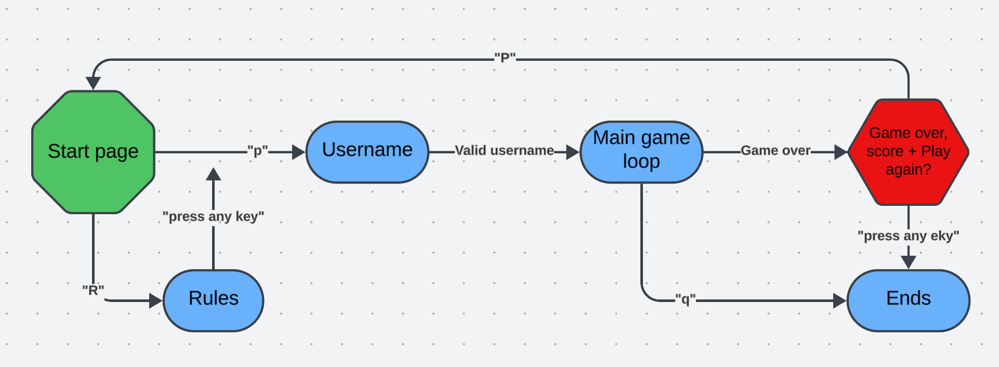
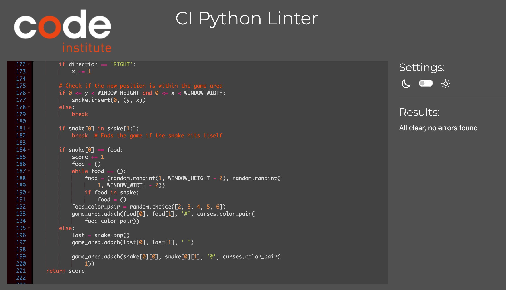

# Snake Game

## Introduciton 
Welcome to the Snake Game, a classic text-based game brought to life using Python. This project is a simple yet engaging implementation of the timeless Snake game.

The site is live here: <a href="https://pp3-snake-game-967c9062a992.herokuapp.com/">Snake Game</a>

## Contents
**Table of content:**
- [Snake Game](#snake-game)
    - [Introduction](#introduciton)
- [Contents](#contents)
- [User Experience](#user-experience)
    - [Site Owner Goals](#site-owner-goals)
    - [User Goals](#user-goals)
- [Design](#design)
    - [ASCII Art](#ascii-art)
    - [Colors](#colors)
    - [Flowchart](#flowchart)
- [Features](#features)
    - [Welcome Screen](#welcome-screen)
    - [Rules Screen](#rules-screen)
    - [User Name](#user-name)
    - [Main Game](#main-game)
    - [Live Score](#live-score)
    - [Game Over Screen](#game-over-screen)
-[Features To Add](#features-to-add)
- [Testing](#testing)
    - [Manual Testing](#manual-testing)
    - [CI Python Linter](#ci-python-linter)
    - [WAVE](#wave)
    - [Lighthouse](#lighthouse)
- [Bugs](#bugs)
- [Deployment](#deployment)
    - [Heroku](#heroku)
- [Credit](#credit)

## User Experience

### Site Owner Goals
The owner's goal is to provide a site were you can have fun and play the classic Snake Game you probably playd when you were younger.

### User Goals
The goal is to make the user feel nostalgic and to have fun playing a simpel snake game. Where the user can challange them selfs to get a higher score every time they play.

## Design

Because it's a simpel terminal based game i added colors and ASCII art to make it more fun and give the user a better experience.

### ASCII Art
Both the start screen and game over screen displays ASCII art to make it stand out from the rest of the text in the game.

### Colors
I used 7 standerd colors in the curses module, Black, Green, Cyan, Red, Magenta, White and Blue

The start page displays the ASCII and text in a green color to match with the green snake in the game. The food in the game changes colors to make it look more fun and the game over page dispalys the ASCII art and text in a red color.

### Flowchart

## Fetures

### Welcome Screen

The welcome screen displays ASCII art snake and a welcome message and instructions on how to start the game.

### Rules Screen

The rules screen explains the game rules and waits for user input go go back to menu.

### User Name

The user name function prompts the user to enter their name before the game starts.

### Main Game 

When the game starts the user controls the snakes direction with the arrowkeys. Every time the snake eats the food, new food shows up in a random place, live score increases and the snake grows. If the user hits the game borders or itself the game ends.

### Live Score

For a better user experience the player can see the live score at the top left corner of the screen.

### Game Over Screen

The game over screen displays ASCII art, the user's name and score. Asks if they want to play again and waits for user input.

## Features To Add

Things I like to add to the game in the future to give a better user experience.
<ul>
<li> Highscore page so the user's can compete with each other or themselves. </li>
<li>Different degrees of difficulty, e.g make the game area smaller after a certen score. </li>
<li>Allowing the player to choose the color of the snake.</li>
</ul>

## Testing

### Manual Testing

| Test | Step | Result |
|------|------|--------|
| Heroku |Open live site | Live site runs as expected |
| press "r" to view rules | pressed "r" | Shows rules page |
| Press any key to go back to start menu | tested with different keys | Shows start menu |
| Press "p" to play game | Pressed "p" | show's next page |
| Enter name | typing my name and Enter | Starts the game |
| Enter name | Pressing Enter without typing my name | Ask's me to enter my name again |
| Arrowkeys | pressing arrowkeys to control the snake | Snake moves as expected |
| Border | Snake collides with border | Game ends and shows game over screen |
| snakes body | Snake collides with itself | Game ends and shows game over screen |
| Live score | Snake eat's food | Live score updates with +1 |
| New food | Snake eats food | New food shows up in the game area |
| Play again | Press "p" on game over screen | Shows start menu so I can play again |

### CI Python Linter

Validation of Python code in <a href="https://pep8ci.herokuapp.com/">CI Python Linter</a> - No errors

### WAVE

Accessability testing at <a href="https://wave.webaim.org/">Webaim</a> - No errors

### Lighthouse
Tested the website in lighthouse for desktop.

## Bugs
 During the development and testings several bugs were discoverd.

 | Bug | Fixed/Unfixed |
 |-----|---------------|
 | Snake did not increase it's speed as expected | Fixed |
 | Snake can "eat" the borders | Unfixed |
 | User can press Enter-key without entering name | Fixed |
 | Contrast error on "run program" button in WAVE | Fixed |
 | To long lines and whitespace in CI python linter | Fixed |

## Deployment

### Heroku

To the deploy this project i followed the deployment guide from love sandwiches.

Before i deployd i to Heroku i used "pip3 freeze > requirements.txt" to add dependencies that's requierd for the game to work in Heroku.
<ol>
<li> Set up a Heroku account. </li>
<li> On the Heroku dashboard, select create new app.</li>
<li> Choose a name for your app.</li>
<li> Select a region.</li>
<li> Click on "Create app"</li>
<li> Go to settings and go to Config Vars.</li>
<li> Enter CREDS in the key box and in value add the content from the creds.json file, then click the Add button.</li>
<li> Enter PORT in the next key box and 8000 in the value box, then click Add.</li>
<li> Scroll down to the Buildpack, select the python pack and click on save.</li>
<li> select node.js and save. </li>
<li> Make sure the Bulidpack is in the correct order, python first and node.js second. </li>
<li> Scroll up to the top of the page and click on the Deploy tab. </li>
<li> select GitHub as deployment method. </li>
<li> Enter the name of your repository and connect to it. </li>
<li> Scroll down and choose Enable automatic deployments or deploy manually. </li>
<li> When the deployment is done click on view to see your application. </li>
</ol>

## Credit

Lucidcart was made at <a href="https://lucid.co/ ">Lucid</a> and ASCII art are from <a href="https://www.asciiart.eu/text-to-ascii-art">ASCII Art Archive</a>.

| Knowledge about | Source |
| ----------------|--------|
| How to make a snake game using curses: Mision     Codigo youtube tutorial | https://www.youtube.com/watch?v=_IKIkRMfZJA |
| how to make a snake game using curses: Partick Loeber youtube tutorial| https://www.youtube.com/watch?v=M_npdRYD4K0 |
| how to use colors: | https://www.youtube.com/watch?v=JBE4OwdqzQ8 |
| ASCII art | https://www.asciiart.eu/text-to-ascii-art |
| Curses functions | https://docs.python.org/3/library/curses.html |
| How to split lines in python | https://betterstack.com/community/questions/python-how-to-define-multiline-string/ |